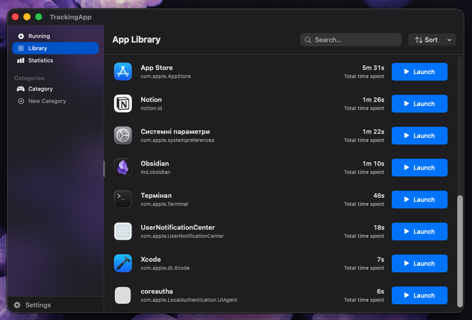
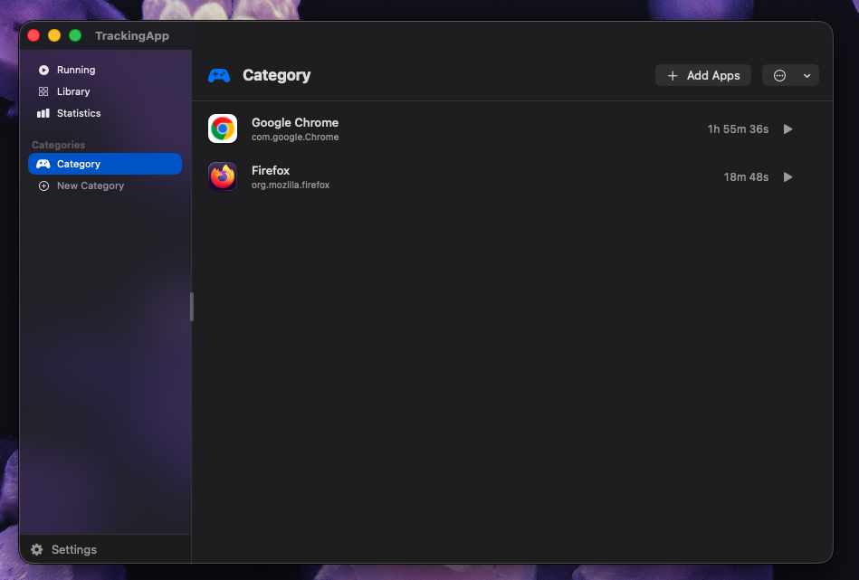
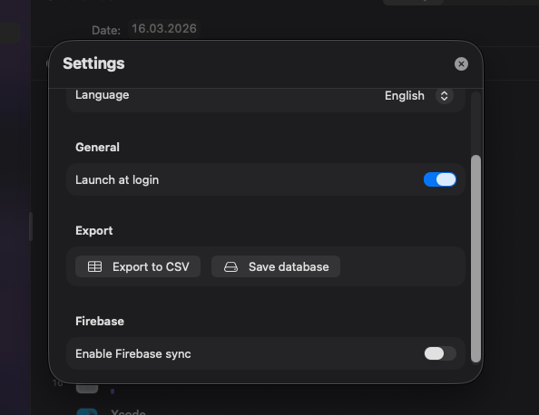

# TrackingApp 📊

[](https://swift.org)
[](https://developer.apple.com/macos/)
[](LICENSE)

A lightweight macOS application that tracks your app usage time, organizes apps into categories, and syncs data to Firebase for web dashboard integration.

---

## 🌐 Languages / Мови / Języki

- English
- Українська
- Polski

---

## ✨ Features

- **Real-time Monitoring**: Tracks active applications every second
- **Usage Statistics**: View daily, weekly, monthly, and all-time statistics
- **App Categories**: Create custom folders and organize your apps
- **App Library**: Steam-like library view with search and sorting
- **Resizable Sidebar**: Customizable sidebar width with visible drag handle
- **Firebase Sync**: Export usage data to Firestore for web integration
- **Multi-language**: Full localization in English, Ukrainian, and Polish
- **Launch at Login**: Optional auto-start with system
- **Data Export**: CSV export and database backup

---

## 📸 Screenshots

### App Library

*Steam-like library view with usage statistics and launch buttons*

### Categories

*Organize your apps into custom categories*

### Settings

*Configure Firebase sync and other preferences*

> ⚠️ **Note**: Some screenshots contain placeholder data. Replace with your own Firebase credentials in the app settings.

---

## 🚀 Installation

### From Source

```bash
git clone https://github.com/yourusername/TrackingApp.git
cd TrackingApp
bash build_app.sh
open TrackingApp.app
```

### Install to Applications

```bash
cp -r TrackingApp.app /Applications/
```

---

## 🔧 Configuration

### Firebase Integration

1. Open Firebase Console and create a new project
2. Enable Firestore Database
3. Update Firestore rules to allow writes from your app:

```javascript
rules_version = '2';
service cloud.firestore {
  match /databases/{database}/documents {
    match /app_usage/{document=**} {
      allow read: if true;
      allow write: if true;
    }
    // Your other rules...
  }
}
```

4. In TrackingApp settings:
   - Enable "Firebase sync"
   - Enter your **Project ID** (e.g., `your-project-id`)
   - Enter **API Key** (optional)
   - Set **Collection name** (default: `app_usage`)
   - Click "Sync now"

---

## 📖 Usage

### Basic Usage

1. **Running Apps**: View currently active applications
2. **Statistics**: Browse usage by time periods (Today, Week, Month, All time)
3. **Library**: See all tracked apps with total usage and launch buttons
4. **Categories**: Create custom folders and organize your apps

### Creating Categories

1. Click **+** in the sidebar Categories section
2. Enter a name and select an icon
3. Add apps to your category using the **Add Apps** button

### Data Export

- **CSV Export**: `Settings → Export → Export to CSV`
- **Database Backup**: `Settings → Export → Save database`

---

## 🛠️ Development

### Requirements

- macOS 14.0+
- Xcode 15+ or Swift 6.2+
- Git

### Building from Source

```bash
# Clone
git clone https://github.com/yourusername/TrackingApp.git
cd TrackingApp

# Build
swift build

# Create .app bundle
bash build_app.sh

# Run
open TrackingApp.app
```

### Project Structure

```
TrackingApp/
├── Sources/TrackingApp/
│   ├── App/
│   │   └── TrackingAppMain.swift
│   ├── Models/
│   │   ├── AppUsageRecord.swift
│   │   ├── RunningAppInfo.swift
│   │   ├── AppCategory.swift
│   │   └── AppSettings.swift
│   ├── Database/
│   │   └── DatabaseManager.swift
│   ├── Services/
│   │   ├── AppMonitorService.swift
│   │   ├── ExportService.swift
│   │   └── FirebaseService.swift
│   ├── Views/
│   │   ├── ContentView.swift
│   │   ├── RunningAppsView.swift
│   │   ├── StatisticsView.swift
│   │   ├── AppLibraryView.swift
│   │   ├── CategoryDetailView.swift
│   │   ├── SettingsView.swift
│   │   └── AutoFocusTextField.swift
│   └── Localization/
│       └── Strings.swift
├── Package.swift
├── Info.plist
├── build_app.sh
├── make_icon.sh
└── README.md
```

### Adding Languages

1. Update `Strings.swift` with new translations
2. Add the language code to `AppLanguage` enum in `AppSettings.swift`

---

## 🤝 Contributing

Contributions are welcome! Please feel free to submit a Pull Request.

1. Fork the repository
2. Create your feature branch (`git checkout -b feature/AmazingFeature`)
3. Commit your changes (`git commit -m 'Add some AmazingFeature'`)
4. Push to the branch (`git push origin feature/AmazingFeature`)
5. Open a Pull Request

---

## 📄 License

This project is licensed under the MIT License - see the [LICENSE](LICENSE) file for details.

---

## 🙏 Acknowledgments

- SwiftUI for the modern UI framework
- SQLite3 for local data storage
- Firebase for cloud synchronization
- All contributors and users

---

---

# 🇺🇦 Українська

**TrackingApp** — легка macOS-програма для відстеження часу використання додатків з можливістю організації в категорії та синхронізації даних у Firebase для веб-інтеграції.

## ✨ Особливості

- **Моніторинг у реальному часі**: Відстежує активні додатки кожну секунду
- **Статистика використання**: Перегляд даних за день, тиждень, місяць та весь час
- **Категорії додатків**: Створюйте власні папки та організовуйте додатки
- **Бібліотека додатків**: Steam-подібний вигляд з пошуком та сортуванням
- **Змінюваний сайдбар**: Налаштовувана ширина з видимою ручкою перетягування
- **Firebase синхронізація**: Експорт даних у Firestore для веб-інтеграції
- **Багатомовність**: Повна локалізація (українська, англійська, польська)
- **Автозапуск**: Опціональний старт із системою
- **Експорт даних**: CSV-експорт та резервна копія бази даних

## 🔧 Встановлення

```bash
git clone https://github.com/yourusername/TrackingApp.git
cd TrackingApp
bash build_app.sh
open TrackingApp.app
```

## 📖 Використання

1. **Запущені додатки**: Перегляньте активні програми
2. **Статистика**: Переглядайте використання за періодами
3. **Бібліотека**: Всі додатки з загальним часом та кнопками запуску
4. **Категорії**: Створюйте папки та організовуйте додатки

---

# 🇵🇱 Polski

**TrackingApp** — lekka aplikacja macOS do śledzenia czasu użytkowania aplikacji, z możliwością organizacji w kategorie i synchronizacji danych z Firebase dla integracji webowej.

## ✨ Funkcje

- **Monitorowanie w czasie rzeczywistym**: Śledzi aktywne aplikacje co sekundę
- **Statystyki użytkowania**: Przeglądaj dane dzienne, tygodniowe, miesięczne i całkowite
- **Kategorie aplikacji**: Twórz własne foldery i organizuj aplikacje
- **Biblioteka aplikacji**: Widok w stylu Steam z wyszukiwaniem i sortowaniem
- **Zmienny pasek boczny**: Dostosowana szerokość z widocznym uchwytem
- **Synchronizacja Firebase**: Eksportuj dane do Firestore dla integracji webowej
- **Wielojęzyczność**: Pełna lokalizacja (polski, angielski, ukraiński)
- **Start przy logowaniu**: Opcjonalny start z systemem
- **Eksport danych**: Eksport CSV i kopia zapasowa bazy danych

## 🔧 Instalacja

```bash
git clone https://github.com/yourusername/TrackingApp.git
cd TrackingApp
bash build_app.sh
open TrackingApp.app
```

## 📖 Użycie

1. **Uruchomione aplikacje**: Wyświetl aktywne programy
2. **Statystyki**: Przeglądaj użycie według okresów
3. **Biblioteka**: Wszystkie aplikacje z całkowitym czasem i przyciskami uruchamiania
4. **Kategorie**: Twórz foldery i organizuj aplikacje